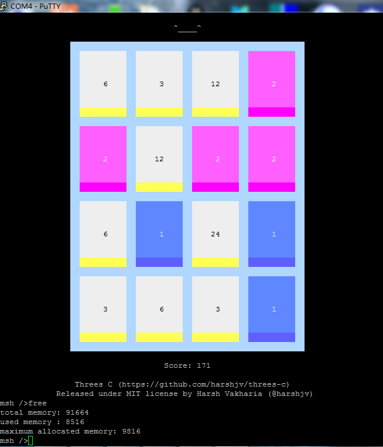

# Threes


Threes，中文又称"[小三传奇](https://baike.baidu.com/item/threes/13028347?fromtitle=%E5%B0%8F%E4%B8%89%E4%BC%A0%E5%A5%87&fromid=13027222) "，是一款数字消除类益智游戏。游戏规则十分简单，1和2合为3，3和3合并为6以此类推，但不可以是3和6合为9，两个3的倍数必须一样。尽可能获得更大的数字，4x4的棋盘填满且无法移动时游戏结束。

该游戏在2014年发布，运行在苹果手机上，在当时风靡全球，是2014年度App Store精选榜单中国区iPhone年度**最佳游戏**。[Harsh Vakharia](https://twitter.com/harshjv)将其用C语言实现并运行在Linux终端上(https://github.com/harshjv/threes-c )。我将其移植到了RT-Thread的Finsh组件上，大家就当开发无聊时打打趣。

在STM32上运行并通过Putty超级终端显示效果如下：



## 使用方法

```
 RT-Thread online packages  --->
    miscellaneous packages  --->
        [*] threes: A game which was very famous in the year of 2014.
```


在Finsh终端下键入：

```shell
msh> threes
```

即可运行，通过WASD按键来模拟原版手机游戏中上下左右的滑动，按Q退出游戏。

原版游戏教学视频：https://www.bilibili.com/video/BV1Ds41117Gs
                 https://www.bilibili.com/video/BV1PC4y1p7cb

## License

MIT


## Author

[Harsh Vakharia](https://twitter.com/harshjv)

Meco Man


## 维护&联系

Meco Man

jiantingman@foxmail.com

https://github.com/mysterywolf/threes
